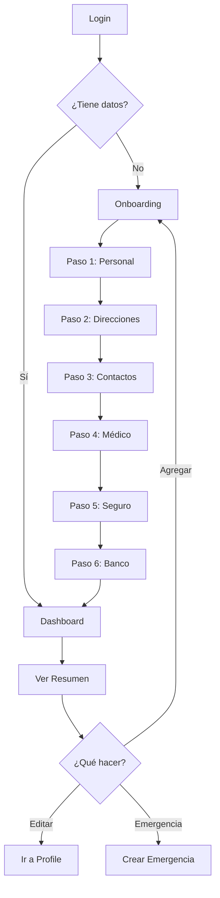

# ⚡ Inicio Rápido - Sistema de Emergencias

## 🎯 Lo Que Se Implementó

### ✅ **Wizard de Onboarding Completo**
- 6 pasos para completar información del usuario
- Guardado automático en cada paso
- Progreso persistente (si cierra, continúa donde quedó)
- Validación en tiempo real
- Puede saltar pasos opcionales

### ✅ **Dashboard con Componentes Extensibles**
- Secciones colapsables/expandibles
- Resumen de toda la información
- Indicadores visuales (principal, cantidad de items)
- Acciones rápidas en cada sección
- Números de cuenta bancaria enmascarados

### ✅ **Sistema de Persistencia**
- Cada paso del onboarding guarda en el backend
- Al recargar, carga el progreso del usuario
- Redireccionamiento inteligente basado en datos

---

## 🚀 Cómo Probar

### 1. Iniciar la aplicación
```bash
npm run dev
```

### 2. Ir a login
```
http://localhost:3000/login
```

### 3. Opciones de prueba:

#### **Opción A: Usuario Nuevo**
1. Regístrate en `/register`
2. Automáticamente te lleva a `/onboarding`
3. Completa los 6 pasos (o salta algunos)
4. Al finalizar, ves el dashboard con tus datos

#### **Opción B: Usuario Existente**
1. Login con credenciales existentes
2. Si no tienes datos → `/onboarding`
3. Si tienes datos → `/dashboard`

---

## 📂 Archivos Creados

### Componentes Nuevos
```
src/components/
├── onboarding/
│   └── OnboardingWizard.tsx        # Wizard de 6 pasos
└── dashboard/
    └── DashboardComponents.tsx      # Componentes reutilizables
```

### Páginas Nuevas
```
src/app/
├── onboarding/
│   └── page.tsx                     # Página del wizard
└── dashboard/
    └── page.tsx                     # Dashboard renovado
```

### Modificaciones
```
src/app/login/page.tsx               # Redireccionamiento inteligente
```

---

## 🎨 Estructura del Onboarding

### Paso 1: Información Personal ⭐
```typescript
- Nombre, Apellido
- Teléfono, RUT
✅ Se guarda al hacer "Siguiente"
```

### Paso 2: Direcciones 📍
```typescript
- Múltiples direcciones
- Etiquetas (Casa, Trabajo)
- Dirección completa
✅ Puede agregar varias
```

### Paso 3: Contactos de Emergencia 📞
```typescript
- Nombre, Teléfono
- Relación, Email
✅ Marcar como principal
```

### Paso 4: Información Médica ❤️
```typescript
- Tipo de sangre
- Alergias (lista dinámica)
- Medicamentos (lista dinámica)
- Condiciones (lista dinámica)
- Notas adicionales
```

### Paso 5: Seguro de Salud 🛡️
```typescript
- Proveedor, Póliza
- Tipo de cobertura
- Fechas de vigencia
```

### Paso 6: Cuenta Bancaria 💳
```typescript
- Banco, Cuenta
- Tipo (corriente/ahorro)
- Titular
```

---

## 📊 Dashboard - Secciones

### Vista del Dashboard:
```
┌─────────────────────────────────────┐
│ ¡Bienvenido, [Nombre]!             │
│ Resumen de tu información personal  │
└─────────────────────────────────────┘

┌─ [👤] Información Personal ─────┐  ← Click para expandir
│  Badge: "Perfil"                 │
│  [Expandido]                     │
│  • Nombre: Juan Pérez            │
│  • Email: juan@email.com         │
│  • Teléfono: +56912345678        │
│  [Editar perfil]                 │
└──────────────────────────────────┘

┌─ [📍] Mis Direcciones ──────────┐  ← Click para expandir
│  Badge: "2 direcciones"          │
│  [Colapsado]                     │
└──────────────────────────────────┘

┌─ [📞] Contactos de Emergencia ──┐
│  Badge: "3 contactos"            │
│  [Colapsado]                     │
└──────────────────────────────────┘

... (más secciones)

┌─ Acciones Rápidas ───────────────┐
│ [🚨 Crear Emergencia]            │
│ [✏️ Editar Perfil]               │
│ [➕ Agregar Datos]               │
└──────────────────────────────────┘
```

---

## 🔄 Flujo Completo de Usuario



---

## 💡 Características Destacadas

### 1. **Persistencia Inteligente**
```typescript
// Al volver al onboarding:
✅ Carga datos existentes
✅ Marca pasos completados
✅ Salta al primer paso incompleto
✅ Prellenar formularios con datos guardados
```

### 2. **Componentes Colapsables**
```typescript
// Dashboard:
✅ Click en sección → Se expande/colapsa
✅ Animación suave
✅ Badge con resumen (ej: "3 contactos")
✅ Botones de acción en cada sección
```

### 3. **Validación y Feedback**
```typescript
// Durante el onboarding:
✅ Errores claros en rojo
✅ Campos obligatorios marcados con *
✅ Loader mientras guarda
✅ Confirmación visual (verde) al completar
```

### 4. **Seguridad**
```typescript
// Números de cuenta:
✅ Enmascarados: ****1234
✅ Solo muestra últimos 4 dígitos
✅ Protección de datos sensibles
```

---

## 🎯 Casos de Uso

### Usuario Primera Vez:
```bash
1. Registro → Onboarding automático
2. Completa 6 pasos (15-20 min)
3. Ve dashboard con todos sus datos
4. Puede editar/agregar más después
```

### Usuario Existente:
```bash
1. Login → Dashboard directo
2. Ve resumen de su información
3. Expande secciones según necesite
4. Edita o agrega datos nuevos
```

### Usuario con Datos Parciales:
```bash
1. Login → Dashboard
2. Ve banner: "¡Completa tu perfil!"
3. Secciones vacías con botón "Agregar"
4. Click "Completar ahora" → Onboarding
```

---

## 🐛 Cómo Probar el Guardado Persistente

### Test 1: Cerrar a mitad del onboarding
```
1. Login → Onboarding
2. Completa Paso 1 (Personal)
3. Completa Paso 2 (Direcciones)
4. CIERRA el navegador
5. Vuelve a abrir y login
6. ✅ Debería continuar en Paso 3
7. ✅ Pasos 1 y 2 marcados como completados
```

### Test 2: Dashboard con datos existentes
```
1. Completa todo el onboarding
2. Llega al dashboard
3. ✅ Todas las secciones tienen datos
4. ✅ Badges muestran cantidades correctas
5. ✅ Items marcados como "Principal" visibles
```

### Test 3: Agregar más datos después
```
1. En dashboard, click "+ Agregar dirección"
2. Te lleva a /profile o /onboarding
3. Agrega nueva dirección
4. Vuelve al dashboard
5. ✅ Nueva dirección aparece en la lista
```

---

## 📝 Documentación Completa

- **Flujo detallado**: Ver `FLUJO_USUARIO.md`
- **API integration**: Ver `API_INTEGRATION_GUIDE.md`
- **Quick reference**: Ver `QUICK_REFERENCE.md`

---

## 🎉 ¡Listo!

Ahora tienes:
✅ Wizard de onboarding completo con 6 pasos
✅ Dashboard con secciones extensibles
✅ Guardado automático en cada paso
✅ Persistencia al cerrar y volver
✅ UX amigable y moderna
✅ Componentes reutilizables y escalables

**Inicia con: `npm run dev` y ve a `/login`** 🚀
